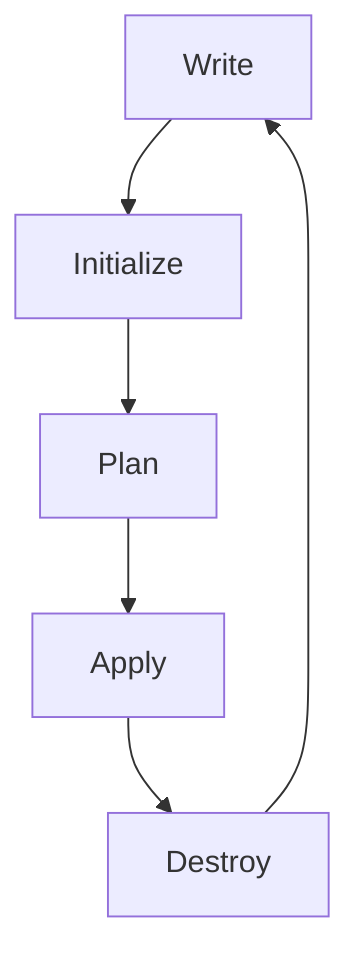

# Day 1 – Terraform Basics & Setup

## Table of Contents
1. [Introduction to Infrastructure as Code (IaC)](#introduction-to-infrastructure-as-code-iac)
2. [Why We Need IaC](#why-we-need-iac)
3. [Terraform vs Other IaC Tools](#terraform-vs-other-iac-tools)
4. [Introduction to Terraform](#introduction-to-terraform)
5. [Terraform Workflow](#terraform-workflow)
6. [Installation & Setup](#installation--setup)
7. [Terraform Language (Basic Syntax)](#terraform-language-basic-syntax)
8. [Terraform Providers and Requirements](#terraform-providers-and-requirements)
9. [First Terraform Project](#first-terraform-project)
10. [Terraform Language Blocks](#terraform-language-blocks)
11. [Hands-on Exercise: Creating S3 Bucket](#hands-on-exercise-creating-s3-bucket)
12. [Best Practices](#best-practices)
13. [Troubleshooting](#troubleshooting)
14. [Conclusion](#conclusion)

---

## Introduction to Infrastructure as Code (IaC)

### What is IaC?

**Infrastructure as Code (IaC)** is a practice that allows you to manage and provision computing infrastructure through machine-readable definition files rather than physical hardware configuration or interactive configuration tools.

#### Key Concepts:
- **Declarative Approach**: Define what you want, not how to achieve it
- **Version Control**: Infrastructure code can be versioned, reviewed, and tracked
- **Automation**: Eliminates manual configuration and reduces human error
- **Consistency**: Ensures identical environments across different stages
- **Scalability**: Easy to replicate and scale infrastructure

### Advantages over Manual Provisioning

| Manual Provisioning | Infrastructure as Code |
|---------------------|------------------------|
| ❌ Time-consuming | ✅ Fast and automated |
| ❌ Error-prone | ✅ Consistent and reliable |
| ❌ Difficult to replicate | ✅ Easy to replicate |
| ❌ No version control | ✅ Full version control |
| ❌ Hard to scale | ✅ Highly scalable |
| ❌ No audit trail | ✅ Complete audit trail |

#### Specific Benefits:
1. **Speed and Efficiency** - Automated provisioning reduces deployment time
2. **Consistency and Reliability** - Identical environments every time
3. **Risk Mitigation** - Reduces human error and improves reliability
4. **Cost Optimization** - Better resource utilization and predictable costs
5. **Compliance and Security** - Audit trails and policy enforcement
6. **Collaboration** - Team collaboration through version control

---

## Why We Need IaC

### Traditional Infrastructure Management Problems:

1. **Manual Configuration**: Time-consuming and error-prone
2. **Environment Drift**: Different environments become inconsistent
3. **Lack of Documentation**: No clear record of infrastructure setup
4. **Slow Recovery**: Manual restoration takes too long
5. **Limited Scalability**: Difficult to replicate environments
6. **Security Issues**: Inconsistent security configurations

### IaC Solutions:

1. **Automation**: Automated provisioning and configuration
2. **Consistency**: Identical environments across all stages
3. **Documentation**: Code serves as living documentation
4. **Fast Recovery**: Infrastructure can be recreated quickly
5. **Scalability**: Easy replication and scaling
6. **Security**: Consistent security policies and configurations

---

## Terraform vs Other IaC Tools

### Comparison Table

| Feature | Terraform | CloudFormation | Ansible | Pulumi |
|---------|-----------|----------------|---------|--------|
| **Approach** | Declarative | Declarative | Declarative/Imperative | Imperative |
| **Language** | HCL | JSON/YAML | YAML | Python/TypeScript/Go |
| **State Management** | ✅ Built-in | ❌ No | ❌ No | ✅ Built-in |
| **Multi-Cloud** | ✅ Excellent | ❌ AWS only | ✅ Good | ✅ Excellent |
| **Learning Curve** | 🟡 Moderate | 🟡 Moderate | 🟢 Easy | 🔴 Steep |

### Why Choose Terraform?

#### **Advantages:**
1. **Multi-Cloud Support** - Works with AWS, Azure, GCP, and many others
2. **State Management** - Tracks infrastructure state and manages dependencies
3. **Large Ecosystem** - 100+ official and community providers
4. **Plan and Apply** - Preview changes before applying them
5. **Declarative** - Define desired state, Terraform figures out how to achieve it

---

## Introduction to Terraform

### What is Terraform?

Terraform is an open-source Infrastructure as Code tool created by HashiCorp. It allows you to define and provision data center infrastructure using a declarative configuration language.

### Key Features:

1. **Declarative Configuration**: Define desired state, Terraform figures out how to achieve it
2. **State Management**: Tracks the current state of your infrastructure
3. **Provider Ecosystem**: Supports 100+ providers (AWS, Azure, GCP, etc.)
4. **Plan and Apply**: Preview changes before applying them
5. **Dependency Management**: Automatically handles resource dependencies
6. **Version Control**: Infrastructure code can be versioned

### Core Concepts:

- **Providers**: Plugins that interact with cloud providers
- **Resources**: Infrastructure objects (EC2 instances, S3 buckets, etc.)
- **Data Sources**: Read-only information about existing resources
- **Variables**: Input parameters for your configuration
- **Outputs**: Exported values from your configuration
- **State**: Current state of your infrastructure

---

## Terraform Workflow

### The Terraform Workflow Cycle



### 1. Write (Code)
- Define infrastructure in `.tf` files using HashiCorp Configuration Language (HCL)
- Specify providers, resources, variables, and outputs

### 2. Initialize (`terraform init`)
```bash
terraform init
```
**What happens:**
- Downloads required providers
- Initializes backend configuration
- Sets up working directory

### 3. Plan (`terraform plan`)
```bash
terraform plan
```
**Plan Output:**
```
Terraform will perform the following actions:

  # aws_s3_bucket.example will be created
  + resource "aws_s3_bucket" "example" {
      + bucket = "my-example-bucket-12345"
      + id     = (known after apply)
    }

Plan: 1 to add, 0 to change, 0 to destroy.
```

### 4. Apply (`terraform apply`)
```bash
terraform apply
```
**Apply Process:**
1. Shows the plan again
2. Prompts for confirmation
3. Creates resources
4. Updates state file

### 5. Destroy (`terraform destroy`)
```bash
terraform destroy
```
**Destroy Process:**
1. Shows what will be destroyed
2. Prompts for confirmation
3. Removes resources in dependency order

### Execution Plan Overview

#### What is an Execution Plan?
An execution plan shows exactly what Terraform will do before making any changes to your infrastructure.

#### Plan Components:
- **Resource Actions**: `+` (create), `-` (destroy), `~` (modify), `-/+` (replace)
- **Attribute Changes**: Shows which attributes will change
- **Dependencies**: Shows resource dependencies and creation order

---

## Installation & Setup

### Installing Terraform CLI

#### **macOS (using Homebrew)**
```bash
brew tap hashicorp/tap
brew install hashicorp/tap/terraform
terraform --version
```

#### **Windows (using Chocolatey)**
```powershell
choco install terraform
terraform --version
```

#### **Linux (Ubuntu/Debian)**
```bash
wget -O- https://apt.releases.hashicorp.com/gpg | sudo gpg --dearmor -o /usr/share/keyrings/hashicorp-archive-keyring.gpg
echo "deb [signed-by=/usr/share/keyrings/hashicorp-archive-keyring.gpg] https://apt.releases.hashicorp.com $(lsb_release -cs) main" | sudo tee /etc/apt/sources.list.d/hashicorp.list
sudo apt update
sudo apt install terraform
```

### Installing AWS CLI & Configuring Credentials

#### **Install AWS CLI**
```bash
# macOS
brew install awscli

# Windows
choco install awscli

# Linux
curl "https://awscli.amazonaws.com/awscli-exe-linux-x86_64.zip" -o "awscliv2.zip"
unzip awscliv2.zip
sudo ./aws/install
```

#### **Configure AWS Credentials**
```bash
aws configure

# You'll be prompted for:
# AWS Access Key ID: [Your Access Key]
# AWS Secret Access Key: [Your Secret Key]
# Default region name: [e.g., us-west-2]
# Default output format: [json]
```

#### **Verify AWS Configuration**
```bash
aws sts get-caller-identity
```

### Setting up Working Directory & .tf Files

#### **Create Project Structure**
```bash
mkdir terraform-demo
cd terraform-demo
touch main.tf variables.tf outputs.tf providers.tf terraform.tfvars .gitignore
```

#### **Project Structure**
```
terraform-demo/
├── main.tf          # Main configuration file
├── variables.tf     # Variable definitions
├── outputs.tf       # Output definitions
├── providers.tf     # Provider configurations
├── terraform.tfvars # Variable values
└── .gitignore       # Git ignore file
```

#### **Create .gitignore**
```gitignore
# Terraform files
*.tfstate
*.tfstate.*
.terraform/
.terraform.lock.hcl

# Crash log files
crash.log
crash.*.log

# Exclude sensitive files
*.tfvars
*.tfvars.json
```

---

## Terraform Language (Basic Syntax)

### File Structure

Terraform uses `.tf` files with HashiCorp Configuration Language (HCL):

```hcl
# main.tf - Main configuration file
# variables.tf - Variable definitions
# outputs.tf - Output definitions
# providers.tf - Provider configurations
```

### Basic Syntax Rules:

1. **Blocks**: Defined with curly braces `{}`
2. **Arguments**: Key-value pairs using `=`
3. **Comments**: `#` for single-line, `/* */` for multi-line
4. **Strings**: Can be quoted or unquoted
5. **Lists**: `["item1", "item2"]`
6. **Maps**: `{key1 = "value1", key2 = "value2"}`

### Example Configuration:

```hcl
# Provider configuration
provider "aws" {
  region = "us-west-2"
}

# Variable definition
variable "instance_type" {
  description = "EC2 instance type"
  type        = string
  default     = "t2.micro"
}

# Resource definition
resource "aws_instance" "example" {
  ami           = "ami-12345678"
  instance_type = var.instance_type
  
  tags = {
    Name = "Example Instance"
  }
}

# Output definition
output "instance_id" {
  value = aws_instance.example.id
}
```

### Data Types:

- **String**: `"hello"`
- **Number**: `42`
- **Bool**: `true` or `false`
- **List**: `["a", "b", "c"]`
- **Map**: `{key = "value"}`
- **Object**: `{name = "John", age = 30}`
- **Tuple**: `["string", 1, true]`

---

## Terraform Providers and Requirements

### What are Providers?

Providers are plugins that Terraform uses to interact with cloud providers, SaaS providers, and other APIs. They define and manage resources.

### Popular Providers:

1. **AWS Provider**: `hashicorp/aws`
2. **Azure Provider**: `hashicorp/azurerm`
3. **Google Cloud Provider**: `hashicorp/google`
4. **Docker Provider**: `hashicorp/docker`
5. **Kubernetes Provider**: `hashicorp/kubernetes`
6. **GitHub Provider**: `integrations/github`

### Provider Source Addresses

#### Official HashiCorp Providers
```hcl
# AWS Provider
hashicorp/aws

# Azure Provider
hashicorp/azurerm

# Google Cloud Provider
hashicorp/google

# Docker Provider
hashicorp/docker

# Kubernetes Provider
hashicorp/kubernetes
```

#### Third-Party Providers
```hcl
# GitHub Provider
integrations/github

# Datadog Provider
datadog/datadog

# Vault Provider
hashicorp/vault
```

### Provider Requirements

#### What are Provider Requirements?

Provider requirements are declarations that specify which providers your Terraform configuration depends on, including their source addresses and version constraints.

#### Basic Provider Requirements Syntax

```hcl
terraform {
  required_providers {
    aws = {
      source  = "hashicorp/aws"
      version = "~> 4.0"
    }
    azurerm = {
      source  = "hashicorp/azurerm"
      version = ">= 2.0, < 3.0"
    }
  }
}
```

### Version Constraints

#### Version Constraint Syntax

| Constraint | Meaning | Example |
|------------|---------|---------|
| `= 1.0.0` | Exact version | `version = "= 1.0.0"` |
| `!= 1.0.0` | Not equal to version | `version = "!= 1.0.0"` |
| `> 1.0.0` | Greater than version | `version = "> 1.0.0"` |
| `>= 1.0.0` | Greater than or equal to | `version = ">= 1.0.0"` |
| `< 1.0.0` | Less than version | `version = "< 1.0.0"` |
| `<= 1.0.0` | Less than or equal to | `version = "<= 1.0.0"` |
| `~> 1.0` | Allows patch-level changes | `version = "~> 1.0"` |
| `~> 1.0.0` | Allows patch-level changes | `version = "~> 1.0.0"` |
| `>= 1.0.0, < 2.0.0` | Version range | `version = ">= 1.0.0, < 2.0.0"` |

#### Common Version Constraint Patterns

```hcl
# Allow any 4.x version
version = "~> 4.0"

# Allow any 4.16.x version
version = "~> 4.16"

# Allow versions 2.0.0 and above, but below 3.0.0
version = ">= 2.0.0, < 3.0.0"

# Allow any version 1.0.0 or higher
version = ">= 1.0.0"

# Exact version (not recommended for production)
version = "= 4.16.0"
```

### Provider Configuration Examples

#### Single Provider
```hcl
terraform {
  required_providers {
    aws = {
      source  = "hashicorp/aws"
      version = "~> 4.0"
    }
  }
}

provider "aws" {
  region = "us-west-2"
}
```

#### Multiple Providers
```hcl
terraform {
  required_providers {
    aws = {
      source  = "hashicorp/aws"
      version = "~> 4.0"
    }
    azurerm = {
      source  = "hashicorp/azurerm"
      version = "~> 3.0"
    }
    google = {
      source  = "hashicorp/google"
      version = "~> 4.0"
    }
  }
}
```

#### Provider with Aliases
```hcl
terraform {
  required_providers {
    aws = {
      source  = "hashicorp/aws"
      version = "~> 4.0"
      configuration_aliases = [aws.us_west_2, aws.us_east_1]
    }
  }
}

provider "aws" {
  alias  = "us_west_2"
  region = "us-west-2"
}

provider "aws" {
  alias  = "us_east_1"
  region = "us-east-1"
}

# Using provider aliases in resources
resource "aws_instance" "primary" {
  provider = aws.us_west_2
  # ... other configuration
}

resource "aws_instance" "secondary" {
  provider = aws.us_east_1
  # ... other configuration
}
```

### Provider Configuration

#### Basic Provider Configuration
```hcl
# AWS Provider
provider "aws" {
  region = "us-west-2"
  profile = "default"
}

# Azure Provider
provider "azurerm" {
  features {}
  subscription_id = "your-subscription-id"
  tenant_id       = "your-tenant-id"
}

# Google Cloud Provider
provider "google" {
  project = "your-project-id"
  region  = "us-central1"
}
```

#### Advanced Provider Configuration
```hcl
terraform {
  required_providers {
    aws = {
      source  = "hashicorp/aws"
      version = "~> 4.0"
    }
  }
}

variable "aws_region" {
  description = "AWS region"
  type        = string
  default     = "us-west-2"
}

provider "aws" {
  region = var.aws_region
  
  default_tags {
    tags = {
      Environment = var.environment
      ManagedBy   = "Terraform"
    }
  }
}
```

### Provider Installation and Management

#### Automatic Provider Installation
Terraform automatically downloads required providers when you run:
```bash
terraform init
```

#### Provider Cache Location
- **Linux/macOS**: `~/.terraform.d/plugin-cache`
- **Windows**: `%APPDATA%\terraform.d\plugin-cache`

#### Provider Lock File
Terraform creates a `.terraform.lock.hcl` file that locks provider versions:

```hcl
# .terraform.lock.hcl
terraform {
  required_version = ">= 1.0"
  required_providers {
    aws = {
      source  = "hashicorp/aws"
      version = "4.16.0"
    }
  }
}
```

### Provider Requirements Best Practices

#### 1. Version Constraints
```hcl
# ✅ Good: Use tilde (~>) for minor version updates
version = "~> 4.0"

# ✅ Good: Specify version ranges for major updates
version = ">= 4.0.0, < 5.0.0"

# ❌ Avoid: Exact versions (hard to maintain)
version = "= 4.16.0"

# ❌ Avoid: No version constraint (unpredictable)
version = ">= 0"
```

#### 2. Provider Organization
```hcl
# ✅ Good: Group related providers
terraform {
  required_providers {
    # Cloud providers
    aws = {
      source  = "hashicorp/aws"
      version = "~> 4.0"
    }
    azurerm = {
      source  = "hashicorp/azurerm"
      version = "~> 3.0"
    }
    
    # Infrastructure tools
    kubernetes = {
      source  = "hashicorp/kubernetes"
      version = "~> 2.0"
    }
    helm = {
      source  = "hashicorp/helm"
      version = "~> 2.0"
    }
  }
}
```

#### 3. Module Provider Requirements
```hcl
# In a module (modules/vpc/main.tf)
terraform {
  required_providers {
    aws = {
      source  = "hashicorp/aws"
      version = "~> 4.0"
    }
  }
}

# In the root module
module "vpc" {
  source = "./modules/vpc"
  
  providers = {
    aws = aws
  }
}
```

### Troubleshooting Provider Issues

#### Common Issues and Solutions

1. **Provider Not Found**
```bash
# Error: Could not find provider "hashicorp/aws"
# Solution: Check source address and run terraform init
terraform init
```

2. **Version Conflicts**
```bash
# Error: Provider version constraint conflicts
# Solution: Update version constraints in required_providers
terraform init -upgrade
```

3. **Provider Configuration Errors**
```bash
# Error: Provider configuration not found
# Solution: Ensure provider is configured in your Terraform files
```

#### Provider Validation Commands
```bash
# Validate configuration
terraform validate

# Check provider versions
terraform version

# Upgrade providers
terraform init -upgrade

# Clean provider cache
rm -rf .terraform
terraform init
```

### Provider Features:

- **Authentication**: Multiple authentication methods
- **Region Support**: Multi-region deployments
- **Resource Types**: Comprehensive resource coverage
- **Data Sources**: Read existing infrastructure
- **Customization**: Provider-specific configuration options

---

## First Terraform Project

### Provider Block Basics

#### What is a Provider?
A provider is a plugin that Terraform uses to interact with cloud providers, SaaS providers, and other APIs.

#### Provider Block Syntax
```hcl
# Basic provider block
provider "aws" {
  region = "us-west-2"
}

# Provider with version constraint
terraform {
  required_providers {
    aws = {
      source  = "hashicorp/aws"
      version = "~> 4.0"
    }
  }
}
```

#### Common Provider Arguments
```hcl
provider "aws" {
  region  = "us-west-2"
  profile = "default"
  
  default_tags {
    tags = {
      Environment = "Development"
      ManagedBy   = "Terraform"
    }
  }
}
```

### Creating First AWS Resource (aws_s3_bucket)

#### Basic S3 Bucket Configuration
```hcl
# providers.tf
terraform {
  required_providers {
    aws = {
      source  = "hashicorp/aws"
      version = "~> 4.0"
    }
  }
}

provider "aws" {
  region = "us-west-2"
}

# main.tf
resource "aws_s3_bucket" "example" {
  bucket = "my-example-bucket-12345"
  
  tags = {
    Name        = "My Example Bucket"
    Environment = "Development"
  }
}
```

#### Enhanced S3 Bucket with Versioning
```hcl
# main.tf
resource "aws_s3_bucket" "example" {
  bucket = "my-example-bucket-12345"
  
  tags = {
    Name        = "My Example Bucket"
    Environment = "Development"
  }
}

# Enable versioning
resource "aws_s3_bucket_versioning" "example" {
  bucket = aws_s3_bucket.example.id
  
  versioning_configuration {
    status = "Enabled"
  }
}

# Block public access
resource "aws_s3_bucket_public_access_block" "example" {
  bucket = aws_s3_bucket.example.id

  block_public_acls       = true
  block_public_policy     = true
  ignore_public_acls      = true
  restrict_public_buckets = true
}
```

#### Using Variables for Bucket Name
```hcl
# variables.tf
variable "bucket_name" {
  description = "Name of the S3 bucket"
  type        = string
  default     = "my-example-bucket"
}

variable "environment" {
  description = "Environment name"
  type        = string
  default     = "development"
}

# main.tf
resource "aws_s3_bucket" "example" {
  bucket = "${var.bucket_name}-${random_id.bucket_suffix.hex}"
  
  tags = {
    Name        = var.bucket_name
    Environment = var.environment
  }
}

# Generate random suffix for unique bucket name
resource "random_id" "bucket_suffix" {
  byte_length = 4
}
```

#### Adding Outputs
```hcl
# outputs.tf
output "bucket_name" {
  description = "Name of the created S3 bucket"
  value       = aws_s3_bucket.example.bucket
}

output "bucket_arn" {
  description = "ARN of the created S3 bucket"
  value       = aws_s3_bucket.example.arn
}

output "bucket_region" {
  description = "Region where the bucket was created"
  value       = aws_s3_bucket.example.region
}
```

---

## Terraform Language Blocks

### 1. Terraform Block

**Purpose**: Configure Terraform behavior and requirements

```hcl
terraform {
  required_version = ">= 1.0"
  required_providers {
    aws = {
      source  = "hashicorp/aws"
      version = "~> 4.0"
    }
  }
  
  backend "s3" {
    bucket = "my-terraform-state"
    key    = "prod/terraform.tfstate"
    region = "us-west-2"
  }
}
```

### 2. Provider Block

**Purpose**: Configure provider settings

```hcl
provider "aws" {
  region = "us-west-2"
  profile = "default"
  
  default_tags {
    tags = {
      Environment = "Production"
      ManagedBy   = "Terraform"
    }
  }
}
```

### 3. Resource Block

**Purpose**: Define infrastructure resources

```hcl
resource "aws_instance" "web_server" {
  ami           = data.aws_ami.ubuntu.id
  instance_type = var.instance_type
  
  vpc_security_group_ids = [aws_security_group.web.id]
  subnet_id              = aws_subnet.public.id
  
  user_data = templatefile("${path.module}/user_data.sh", {
    server_name = "Web Server"
  })
  
  tags = {
    Name = "Web Server"
    Environment = var.environment
  }
  
  lifecycle {
    create_before_destroy = true
  }
}
```

### 4. Data Source Block

**Purpose**: Fetch information about existing resources

```hcl
data "aws_ami" "ubuntu" {
  most_recent = true
  owners      = ["099720109477"] # Canonical
  
  filter {
    name   = "name"
    values = ["ubuntu/images/hvm-ssd/ubuntu-focal-20.04-amd64-server-*"]
  }
  
  filter {
    name   = "virtualization-type"
    values = ["hvm"]
  }
}
```

### 5. Variable Block

**Purpose**: Define input variables

```hcl
variable "instance_type" {
  description = "EC2 instance type"
  type        = string
  default     = "t2.micro"
  
  validation {
    condition     = contains(["t2.micro", "t2.small", "t2.medium"], var.instance_type)
    error_message = "Instance type must be t2.micro, t2.small, or t2.medium."
  }
}

variable "environment" {
  description = "Environment name"
  type        = string
  
  validation {
    condition     = contains(["dev", "staging", "prod"], var.environment)
    error_message = "Environment must be dev, staging, or prod."
  }
}
```

### 6. Output Block

**Purpose**: Export values from configuration

```hcl
output "instance_id" {
  description = "ID of the created instance"
  value       = aws_instance.web_server.id
}

output "public_ip" {
  description = "Public IP address of the instance"
  value       = aws_instance.web_server.public_ip
  sensitive   = false
}
```

### 7. Local Values Block

**Purpose**: Define local variables for reuse

```hcl
locals {
  common_tags = {
    Environment = var.environment
    ManagedBy   = "Terraform"
    Project     = "Web Application"
  }
  
  instance_name = "${var.environment}-web-server"
}
```

### 8. Module Block

**Purpose**: Reuse and organize code

```hcl
module "vpc" {
  source = "./modules/vpc"
  
  vpc_cidr = "10.0.0.0/16"
  environment = var.environment
  
  public_subnets  = ["10.0.1.0/24", "10.0.2.0/24"]
  private_subnets = ["10.0.3.0/24", "10.0.4.0/24"]
}
```

### 9. Data Source Block (Advanced)

**Purpose**: Fetch complex data structures

```hcl
data "aws_caller_identity" "current" {}

data "aws_region" "current" {}

data "aws_availability_zones" "available" {
  state = "available"
}
```

### 10. Moved Block (Terraform 1.1+)

**Purpose**: Handle resource renames and moves

```hcl
moved {
  from = aws_instance.old_name
  to   = aws_instance.new_name
}
```

---

## Hands-on Exercise: Creating S3 Bucket

### Step-by-Step Guide

#### Step 1: Create Project Directory
```bash
mkdir terraform-s3-demo
cd terraform-s3-demo
```

#### Step 2: Create Terraform Files
```bash
touch main.tf variables.tf outputs.tf providers.tf .gitignore
```

#### Step 3: Configure Providers
```hcl
# providers.tf
terraform {
  required_providers {
    aws = {
      source  = "hashicorp/aws"
      version = "~> 4.0"
    }
  }
}

provider "aws" {
  region = "us-west-2"
}
```

#### Step 4: Define Variables
```hcl
# variables.tf
variable "bucket_name" {
  description = "Name of the S3 bucket"
  type        = string
  default     = "my-terraform-demo-bucket"
}

variable "environment" {
  description = "Environment name"
  type        = string
  default     = "development"
}
```

#### Step 5: Create S3 Bucket Resource
```hcl
# main.tf
resource "aws_s3_bucket" "demo" {
  bucket = "${var.bucket_name}-${random_id.bucket_suffix.hex}"
  
  tags = {
    Name        = var.bucket_name
    Environment = var.environment
    ManagedBy   = "Terraform"
  }
}

# Generate random suffix for unique bucket name
resource "random_id" "bucket_suffix" {
  byte_length = 4
}

# Enable versioning
resource "aws_s3_bucket_versioning" "demo" {
  bucket = aws_s3_bucket.demo.id
  
  versioning_configuration {
    status = "Enabled"
  }
}

# Block public access
resource "aws_s3_bucket_public_access_block" "demo" {
  bucket = aws_s3_bucket.demo.id

  block_public_acls       = true
  block_public_policy     = true
  ignore_public_acls      = true
  restrict_public_buckets = true
}
```

#### Step 6: Define Outputs
```hcl
# outputs.tf
output "bucket_name" {
  description = "Name of the created S3 bucket"
  value       = aws_s3_bucket.demo.bucket
}

output "bucket_arn" {
  description = "ARN of the created S3 bucket"
  value       = aws_s3_bucket.demo.arn
}

output "bucket_region" {
  description = "Region where the bucket was created"
  value       = aws_s3_bucket.demo.region
}
```

#### Step 7: Create .gitignore
```gitignore
# Terraform files
*.tfstate
*.tfstate.*
.terraform/
.terraform.lock.hcl

# Crash log files
crash.log
crash.*.log

# Exclude sensitive files
*.tfvars
*.tfvars.json
```

#### Step 8: Execute Terraform Commands
```bash
# Initialize Terraform
terraform init

# Plan the deployment
terraform plan

# Apply the configuration
terraform apply

# Verify the deployment
terraform output

# Clean up
terraform destroy
```

### Expected Outputs

#### terraform init output:
```
Initializing the backend...

Initializing provider plugins...
- Finding hashicorp/aws versions matching "~> 4.0"...
- Installing hashicorp/aws v4.67.0...
- Installed hashicorp/aws v4.67.0 (signed by HashiCorp)

Terraform has been successfully initialized!
```

#### terraform plan output:
```
Terraform will perform the following actions:

  # aws_s3_bucket.demo will be created
  + resource "aws_s3_bucket" "demo" {
      + bucket = "my-terraform-demo-bucket-a1b2c3d4"
      + id     = (known after apply)
      + region = "us-west-2"
      + tags   = {
          + "Environment" = "development"
          + "ManagedBy"   = "Terraform"
          + "Name"        = "my-terraform-demo-bucket"
        }
    }

Plan: 4 to add, 0 to change, 0 to destroy.
```

#### terraform apply output:
```
Apply complete! Resources: 4 added, 0 changed, 0 destroyed.

Outputs:

bucket_arn = "arn:aws:s3:::my-terraform-demo-bucket-a1b2c3d4"
bucket_name = "my-terraform-demo-bucket-a1b2c3d4"
bucket_region = "us-west-2"
```

---

## Best Practices

### 1. File Organization
- Separate concerns into different files
- Use consistent naming conventions
- Group related resources together

### 2. Naming Conventions
```hcl
# Use descriptive names
resource "aws_s3_bucket" "user_uploads" {
  bucket = "my-app-user-uploads-${var.environment}"
}

# Use consistent tagging
tags = {
  Name        = "User Uploads Bucket"
  Environment = var.environment
  ManagedBy   = "Terraform"
  Project     = "MyApp"
}
```

### 3. Variable Usage
- Use variables for configurable values
- Provide meaningful defaults
- Add descriptions for all variables

### 4. Security
- Never commit sensitive data
- Use variables for secrets
- Implement least privilege access

### 5. Documentation
- Document all variables and outputs
- Include usage examples
- Maintain README files

### 6. Provider Management
- Use version constraints for all providers
- Regularly update provider versions
- Test provider updates in non-production environments
- Use provider aliases for multi-region deployments

### 7. Code Quality
- Use consistent formatting with `terraform fmt`
- Validate configurations with `terraform validate`
- Use meaningful resource names and tags
- Implement proper error handling and validation

---

## Troubleshooting

### Common Issues and Solutions

#### 1. Provider Not Found
```bash
# Error: Could not find provider "hashicorp/aws"
# Solution: Run terraform init
terraform init
```

#### 2. AWS Credentials Not Configured
```bash
# Error: No valid credential sources found
# Solution: Configure AWS credentials
aws configure
```

#### 3. Bucket Name Already Exists
```bash
# Error: BucketAlreadyExists
# Solution: Use unique bucket names or random suffixes
resource "random_id" "bucket_suffix" {
  byte_length = 4
}
```

#### 4. Permission Denied
```bash
# Error: AccessDenied
# Solution: Check IAM permissions
# Required permissions for S3:
# - s3:CreateBucket
# - s3:DeleteBucket
# - s3:PutBucketVersioning
# - s3:PutBucketPublicAccessBlock
```

### Useful Commands

#### Validation and Formatting
```bash
# Format Terraform files
terraform fmt

# Validate configuration
terraform validate

# Check provider versions
terraform version
```

#### State Management
```bash
# List resources in state
terraform state list

# Show resource details
terraform state show aws_s3_bucket.demo
```

---

## Conclusion

Infrastructure as Code with Terraform provides a powerful, flexible, and scalable way to manage infrastructure. By understanding these concepts and following best practices, you can create maintainable, reliable, and efficient infrastructure configurations.

### What We Learned Today:

1. **Infrastructure as Code (IaC)** - Managing infrastructure through code
2. **Terraform Basics** - Understanding the workflow and commands
3. **Provider Configuration** - Setting up AWS provider
4. **Resource Creation** - Creating your first AWS resource (S3 bucket)
5. **Best Practices** - Following Terraform conventions and security practices

### Key Commands:
- `terraform init` - Initialize Terraform
- `terraform plan` - Preview changes
- `terraform apply` - Apply changes
- `terraform destroy` - Clean up resources

### Key Takeaways:

1. **IaC** provides consistency, automation, and version control for infrastructure
2. **Terraform** is a powerful, declarative IaC tool with extensive provider support
3. **Proper organization** and **best practices** are crucial for maintainable code
4. **State management** is essential for tracking infrastructure changes
5. **Security** should always be a priority when managing infrastructure
6. **Provider requirements** ensure consistent and reliable infrastructure deployments
7. **Version constraints** help maintain stability and predictability

### Next Steps:
- Learn about Terraform state management
- Explore more AWS resources (EC2, VPC, etc.)
- Understand Terraform modules
- Practice with different providers

---

*This completes Day 1 of Terraform Basics & Setup. You now have a solid foundation to build upon for more advanced Terraform concepts.*